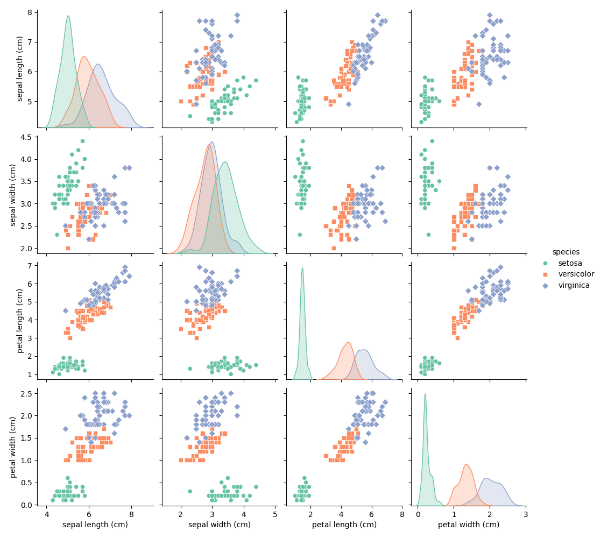
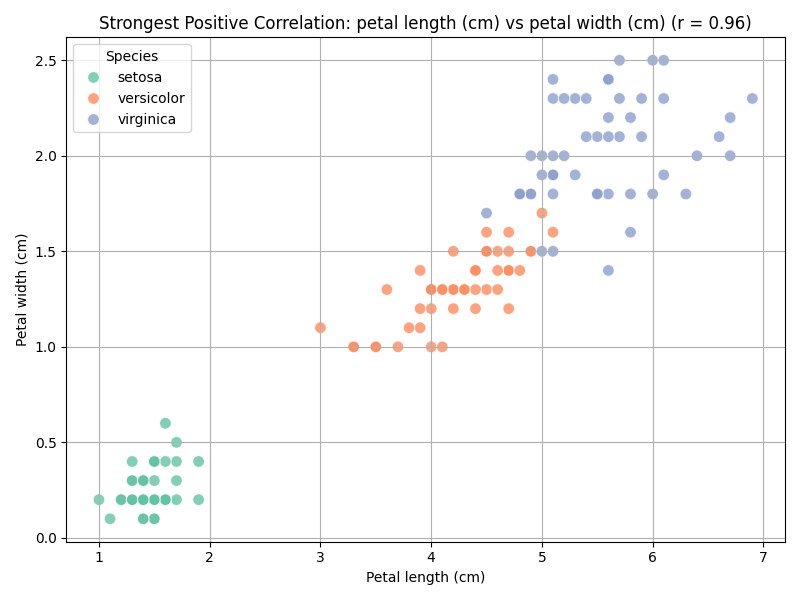

# Iris Dataset Feature Analysis

This Python script analyzes and visualizes relationships between different features of the famous Iris dataset using scatter plots and correlation analysis. The analysis focuses on understanding how different physical measurements of Iris flowers relate to each other and how these relationships vary across different species.

## Assignment Description

This code is part of a data visualization assignment that focuses on:
1. Creating scatter plots for all pairs of features in the Iris dataset
2. Identifying and visualizing the feature pair with the strongest positive correlation

## Dataset Information

The Iris dataset contains measurements of three different Iris flower species:
- Setosa
- Versicolor
- Virginica

### Features
1. Sepal Length (cm)
2. Sepal Width (cm)
3. Petal Length (cm)
4. Petal Width (cm)

## Code Functionality

The script performs the following operations:
1. Loads the Iris dataset from scikit-learn
2. Creates a comprehensive visualization of all feature pairs using scatter plots
3. Calculates correlations between all features
4. Identifies the strongest positively correlated feature pair
5. Creates a detailed scatter plot for the most strongly correlated features

## Output Files

The script generates two visualization files:

### 1. Scatter Plots Matrix (All Features)
This visualization shows the relationships between all pairs of features in the Iris dataset:



**Matrix Layout and Interpretation:**
- The matrix is a 4x4 grid showing all possible feature combinations
- Diagonal plots show the distribution of each feature
- Upper and lower triangles show the same relationships from different perspectives
- Each scatter plot represents the relationship between two features

**Species Representation:**
- Setosa: Represented by circles (o)
- Versicolor: Represented by squares (s)
- Virginica: Represented by diamonds (D)
- Each species is color-coded for easy identification

**Key Patterns Observed:**
- Petal measurements show stronger correlations than sepal measurements
- Setosa species forms distinct clusters in most plots
- Versicolor and Virginica show some overlap in certain feature combinations
- Clear linear relationships visible in petal-related measurements

**Technical Details:**
- Plot Size: 10x8 inches
- Color Palette: Set2 for clear species distinction
- Grid Lines: Enabled for better measurement reference
- Marker Size: Optimized for visibility
- Transparency: Set to 0.8 for better overlap visualization

### 2. Strongest Correlation Plot
This plot shows the scatter plot of the most strongly correlated feature pair:



## Requirements

The following Python libraries are required:
- numpy
- pandas
- matplotlib
- seaborn
- scikit-learn

## How to Run

1. Ensure all required libraries are installed
2. Run the script using Python:
   ```
   python assignment2.py
   ```
3. The script will display the visualizations and save them as PNG files

## Author

Lokesh Para

## Assignment Context

This code is part of the Data Visualization course assignment for Spring 2025, focusing on creating simple scatter plots using Matplotlib and analyzing feature relationships in the Iris dataset. The assignment demonstrates the use of Python's data visualization libraries to explore and understand relationships in multivariate datasets. 